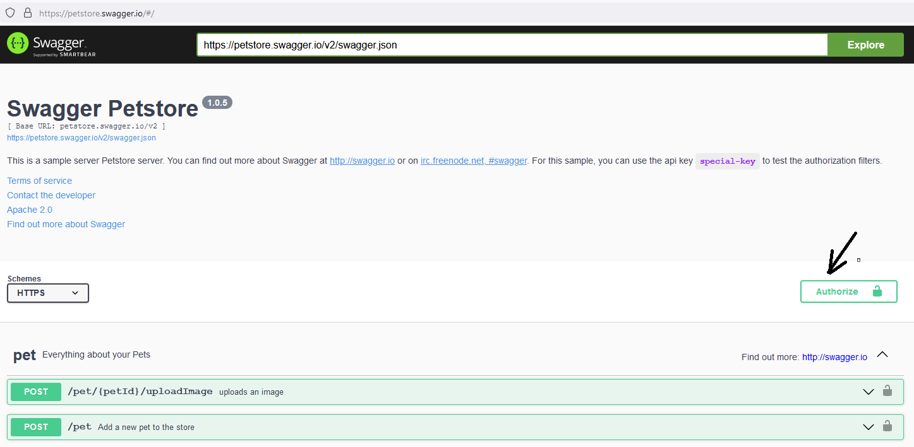
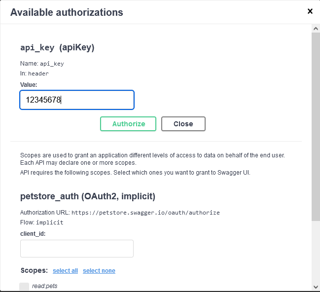
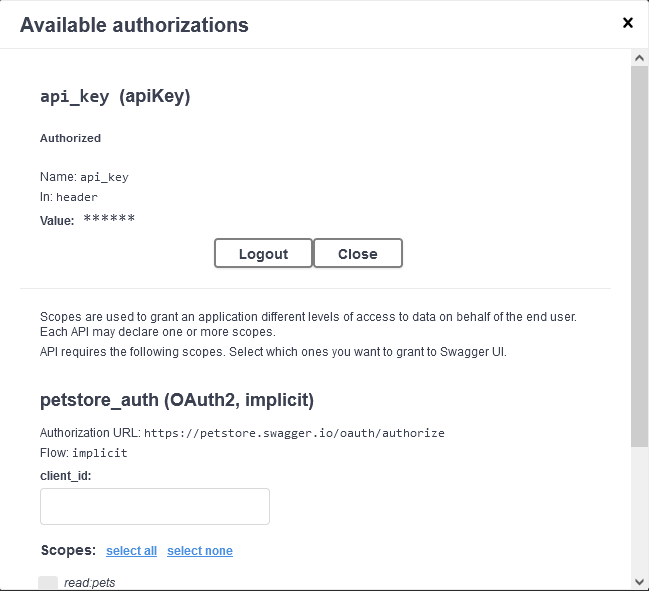

# Api test automation framework built with Mocha and Chai
Test Automation Framework with Mocha, Chai and Ajv

## Instructions

* Clone the repo: `git clone git@git.toptal.com:screening/Fabio-Santoro.git`
* cd API
* npm install
* Create and set and API key (instruction below)
* npm run tests (Prerequisite Create an API Key - Process below)

## How to Create An API Key

* Go to https://petstore.swagger.io/#/
* From the top of the page Click on the "Authorize" button (Screenshot below)
  
*  From the modal, enter an API KEY value (e.g. 1245678)
   
* Press the " Authorize" button
  
* Open a command promp and set the following environment variable API_KEY to the value set in the previous step (e.g. Windows with `cmd` prompt `set APY_KEY=12345678`, with `powershell` prompt `$Env:API_KEY=123456789`, Linux `export API_KEY=123456789`)

## Troubleshooting
* Some but not all tests are failing: Check that the API_Key\'s value has been set correctly (e.g. from Windows command prompt `echo %API_KEY%` , from Windows powershell prompt ` echo $Env:API_KEY`, from Linux command prompt `env`)
* Update and Delete tests are failing: It could be network latency, MochaJs is a really fast tool and the API hosting service could not be fast enough to return the resource
  for the next test to consume.
  Solution, rerun the test.

## Documentation
* Test specifications (swagger): https://petstore.swagger.io
* Bug report can be found ./reports/bug-report/
* Data used for the upload file tests under ./data
* HTML test report will be generated automatically in ./reports/test-reports
